# 🎵 Audio App

Uma plataforma completa de e-commerce especializada em fones, construída com tecnologias modernas para oferecer uma experiência de compra excepcional.

## 📋 Índice

- [Status do Projeto](#status-do-projeto)
- [Funcionalidades](#funcionalidades)
- [Demonstração da Aplicação](#demonstração-da-aplicação)
- [Pré-requisitos](#pré-requisitos)
- [Como Rodar](#como-rodar)
- [Tecnologias Utilizadas](#tecnologias-utilizadas)
- [Estrutura do Projeto](#estrutura-do-projeto)
- [Testes](#testes)
- [Contribuição](#contribuição)
- [Autor](#autor)
- [Licença](#licença)

## 🚀 Status do Projeto


O projeto está em desenvolvimento ativo, com funcionalidades principais implementadas e testes em andamento.

## ✨ Funcionalidades

- 🔍 **Busca e Filtragem**: Encontre produtos por categoria, nome ou preço
- 🛒 **Carrinho de Compras**: Adicione, remova e gerencie itens com persistência
- 👤 **Autenticação**: Cadastro, login e recuperação de senha
- 📱 **Responsivo**: Layout otimizado para mobile e desktop
- 🎨 **UI Moderna**: Interface intuitiva com Tailwind CSS
- 🔒 **Rotas Protegidas**: Acesso seguro ao carrinho e checkout
- 📄 **Página 404**: Experiência amigável para rotas inexistentes

## 🎯 Demonstração da Aplicação

### Screenshots

#### Página Inicial (Desktop)

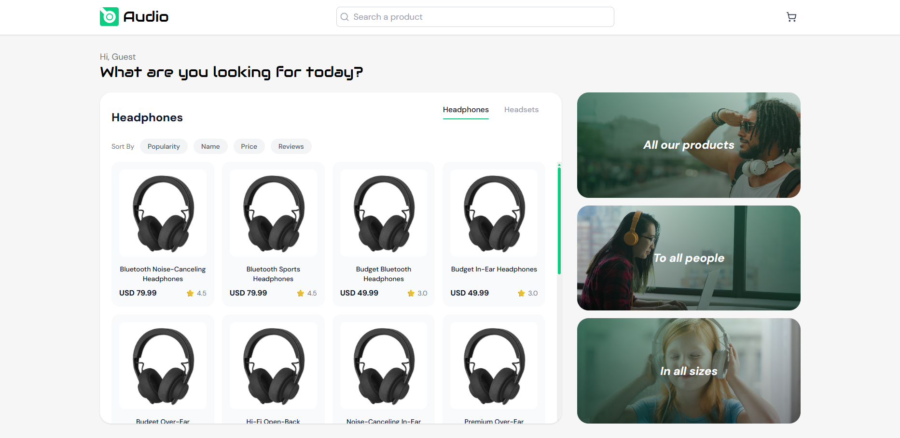

#### Página Inicial (Mobile)

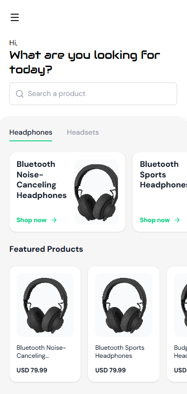

#### Página do Produto (Desktop)

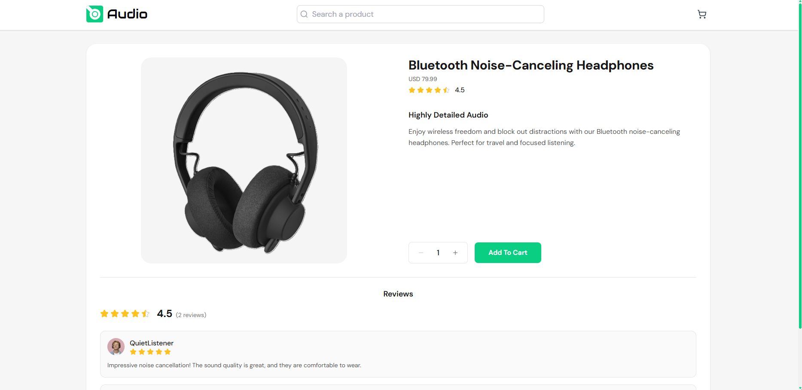

#### Página do Produto (Mobile)

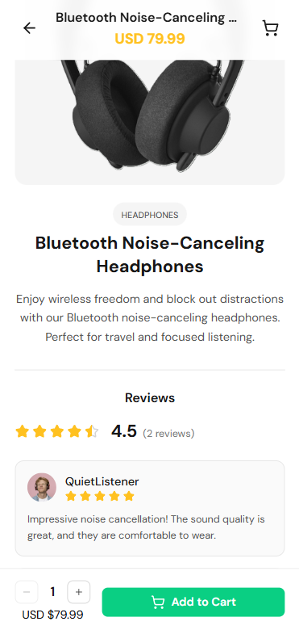

#### Carrinho (Desktop)

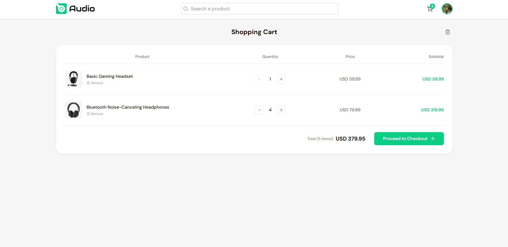

#### Carrinho (Mobile)

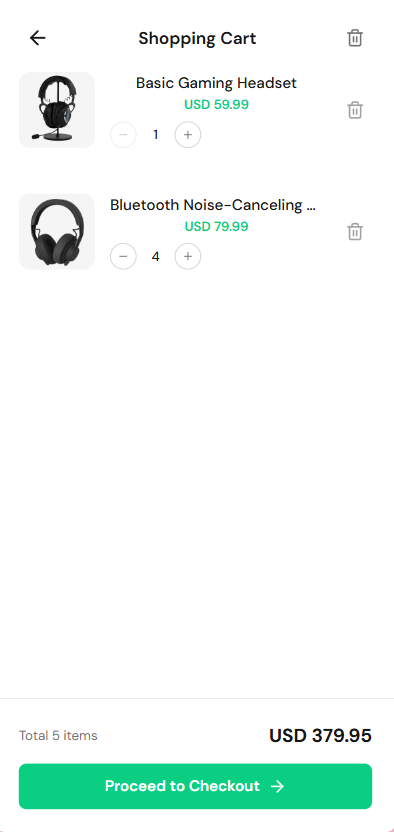

#### Sign-In (Desktop)

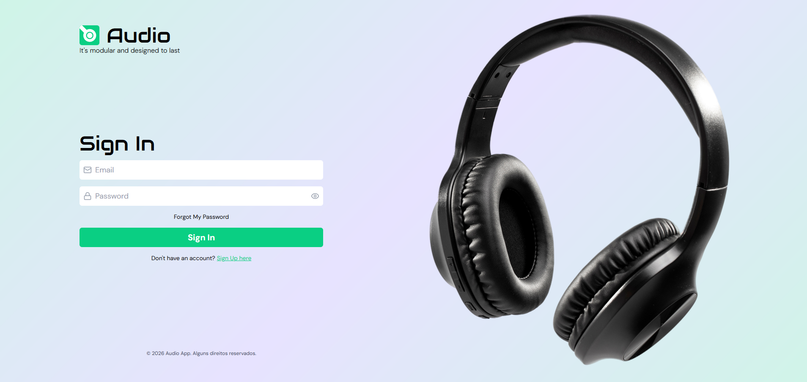

#### Sign-In (Mobile)


#### Sign-Up (Desktop)


#### Sign-Up (Mobile)

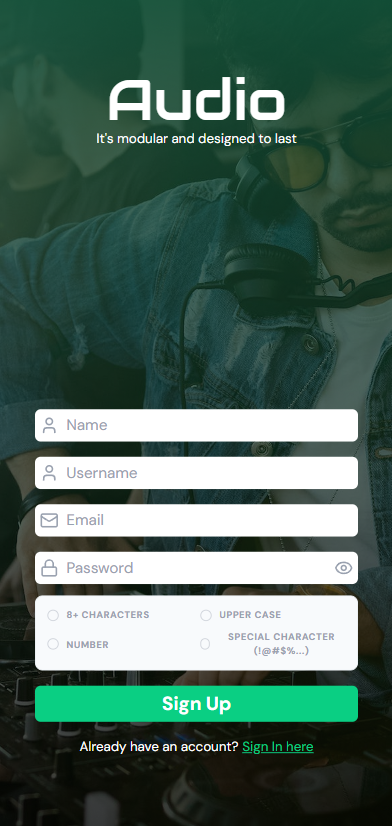

#### Forgot My Password (Desktop)


#### Forgot My Password (Mobile)

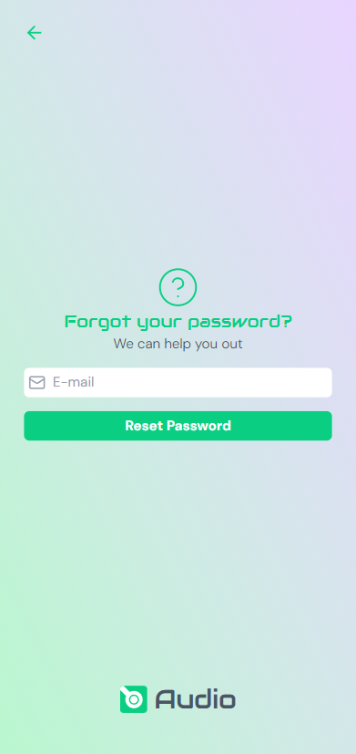

#### Not Found (Desktop)

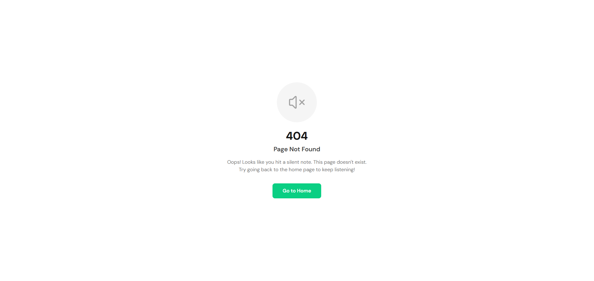

#### Not Found (Mobile)

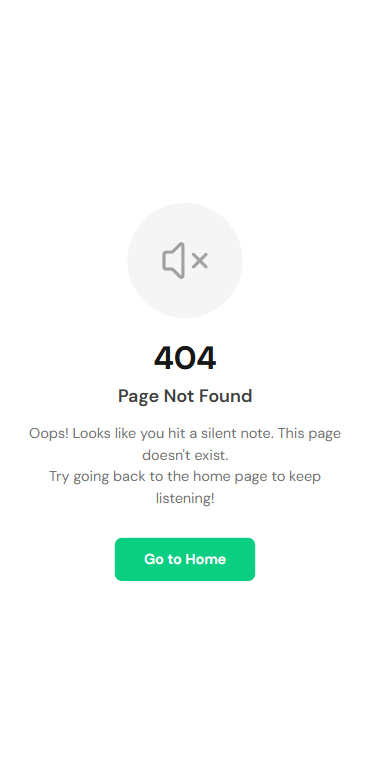

## 📋 Pré-requisitos

Antes de começar, você vai precisar ter instalado em sua máquina as seguintes ferramentas:

- [Node.js](https://nodejs.org/) (versão 18 ou superior)
- [Java](https://adoptium.net/) (versão 25)
- [Maven](https://maven.apache.org/) (versão 3.6 ou superior)
- [Git](https://git-scm.com/)
- Conta no [Supabase](https://supabase.com/) para o banco de dados PostgreSQL

## 🚀 Como Rodar

### Back-End

1. **Clone este repositório**

   ```bash
   git clone https://github.com/vimevili/audio-ecommerce
   cd audio-ecommerce
   ```

2. **Configure o banco de dados**
   - Crie um projeto no Supabase
   - Copie a URL de conexão e chave da API
   - Configure as variáveis de ambiente no arquivo `backend/src/main/resources/application.properties` (baseado no `application.properties.example`)

3. **Execute o Back-End**

   ```bash
   cd backend
   ./mvnw spring-boot:run
   ```

   O servidor estará rodando em `http://localhost:8080`
   docker compose up --build

### Rodando com Docker Compose

O projeto está totalmente containerizado, facilitando o setup do ambiente de desenvolvimento. Seguindo as melhores práticas de segurança, as credenciais sensíveis são gerenciadas via variáveis de ambiente.

#### Passos para execução:

1. **Gerenciamento de Segredos:**
   O backend espera um arquivo `.env` para carregar as credenciais. Use o modelo disponível:

   ```bash
   cp backend/.env.example backend/.env
   ```

   Certifique-se de preencher o arquivo `.env` com suas chaves reais. Este arquivo é ignorado pelo Git para evitar o vazamento de segredos.

2. **Subir a Infraestrutura:**
   Na raiz do projeto, execute o comando para construir a imagem e subir os containers:
   ```bash
   docker-compose up --build
   ```

🛡️ **Nota Técnica sobre Conectividade:**
Para garantir a estabilidade em ambientes de desenvolvimento e contornar restrições comuns de redes residenciais (bloqueios de portas padrão), o projeto utiliza o Transaction Pooler do Supabase (porta 6543). Essa configuração permite que o container atravesse firewalls locais e mantenha uma conexão resiliente com o banco de dados na nuvem.

**Segurança em Produção:**
Para ambientes de produção (como AWS), os segredos devem ser migrados para serviços gerenciados como AWS Secrets Manager ou Vault. Nunca armazene segredos em texto puro no histórico do repositório.

### Front-End

1. **Instale as dependências**

   ```bash
   cd frontend
   npm install
   ```

2. **Execute o Front-End**

   ```bash
   npm run dev
   ```

   A aplicação estará rodando em `http://localhost:5173`

### Testes

Para executar os testes:

```bash
# Front-End
cd frontend
npm run test

# Back-End
cd backend
./mvnw test
```

## 🛠 Tecnologias Utilizadas

### Front-End

- **React 19** - Biblioteca JavaScript para interfaces
- **TypeScript** - Superset JavaScript com tipagem estática
- **Vite** - Ferramenta de build rápida
- **Tailwind CSS** - Framework CSS utilitário
- **TanStack Router** - Roteamento type-safe
- **TanStack Query** - Gerenciamento de estado e cache
- **Radix UI** - Componentes primitivos acessíveis
- **Lucide React** - Biblioteca de ícones
- **React Hook Form** - Gerenciamento de formulários
- **Zod** - Validação de esquemas
- **Axios** - Cliente HTTP
- **Embla Carousel** - Carrossel responsivo
- **Sonner** - Notificações toast
- **Vitest** - Framework de testes
- **Testing Library** - Utilitários de teste

### Back-end

- **Spring Boot 4** - Framework Java para aplicações web
- **Java 25** - Linguagem de programação
- **Spring Data JPA** - ORM para persistência
- **Spring Web MVC** - Framework web
- **Spring Security** - Autenticação e autorização
- **PostgreSQL via Supabase** - Banco de dados relacional como serviço
- **JUnit** - Framework de testes

## 📁 Estrutura do Projeto

```
audio-ecommerce/
├── backend/
│   ├── src/
│   │   ├── main/
│   │   │   ├── java/com/vimevili/audio_ecommerce/
│   │   │   │   ├── controllers/    # Controladores REST
│   │   │   │   ├── dtos/           # Objetos de Transferência de Dados
│   │   │   │   ├── enums/          # Enumerações
│   │   │   │   ├── exceptions/     # Tratamento de exceções e exceções personalizadas
│   │   │   │   ├── infra/          # Configurações de infraestrutura
│   │   │   │   ├── models/         # Entidades JPA
│   │   │   │   ├── repositories/   # Interfaces de repositório
│   │   │   │   └── services/       # Lógica de negócio
│   │   │   └── resources/          # Arquivos de configuração
│   │   └── test/                   # Testes unitários
│   └── pom.xml                     # Dependências Maven
├── frontend/
│   ├── src/
│   │   ├── api/                    # Configuração da API
│   │   ├── assets/                 # Recursos estáticos
│   │   ├── components/             # Componentes reutilizáveis globais
│   │   ├── contexts/               # Contextos React
│   │   ├── domain/                 # Configurações de domínio
│   │   ├── features/               # Funcionalidades por módulo
│   │   │   ├── auth/               # Autenticação
│   │   │   ├── cart/               # Carrinho de compras
│   │   │   ├── home/               # Página inicial
│   │   │   ├── not-found/          # Página 404
│   │   │   └── product/            # Detalhes do produto
│   │   ├── hooks/                  # Hooks customizados
│   │   ├── interfaces/             # Tipos TypeScript globais
│   │   ├── routes/                 # Configuração de rotas
│   │   ├── store/                  # Estado global (Zustand)
│   │   ├── styles/                 # Estilos globais
│   │   ├── test/                   # Utilitários de teste
│   │   └── utils/                  # Funções utilitárias
│   ├── package.json                # Dependências Node.js
│   ├── tailwind.config.js          # Configuração Tailwind
│   ├── vite.config.ts              # Configuração Vite
│   └── vitest.config.ts            # Configuração Vitest
└── README.md                       # Este arquivo
```

## 🧪 Testes

O projeto conta com cobertura de testes abrangente:

### Front-End

- **Unitários**: Componentes, hooks e utilitários
- **Integração**: Fluxos completos (ex: carrinho, autenticação)
- **Cobertura**: Aproximadamente 80% de cobertura de código

### Back-End

- **Unitários**: Serviços, controladores e utilitários
- **Integração**: Endpoints da API

Para executar os testes com cobertura:

```bash
cd frontend
npm run test:coverage
```

## 🤝 Contribuição

Contribuições são sempre bem-vindas! Para contribuir:

1. Fork o projeto
2. Crie uma branch para sua feature (`git checkout -b feature/AmazingFeature`)
3. Commit suas mudanças (`git commit -m 'Add some AmazingFeature'`)
4. Push para a branch (`git push origin feature/AmazingFeature`)
5. Abra um Pull Request

### Padrões de Código

- Use TypeScript para tipagem estática
- Siga os padrões ESLint configurados
- Escreva testes para novas funcionalidades
- Mantenha commits organizados por assunto

## 👨‍💻 Autor

**Vinicius Meirelles Coelho**

- [GitHub](https://github.com/vimevili)
- [LinkedIn](https://linkedin.com/in/viniciusmeirelless)
- Email: vinicius_meirelles@outlook.com.br

## 📝 Licença

Este projeto está sob a licença MIT. Veja o arquivo [LICENSE](LICENSE) para mais detalhes.
